# Solar Cell Analyzer: Interface #

## Main menu ##
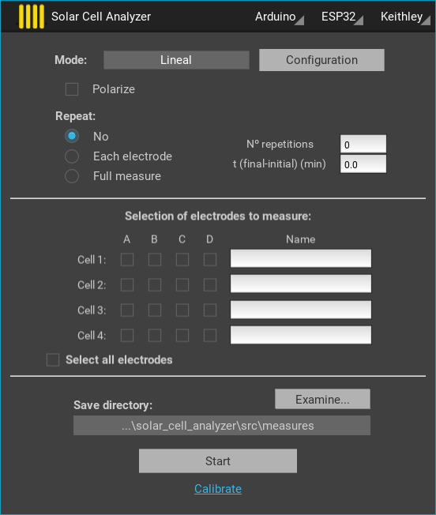

### Top menu ###

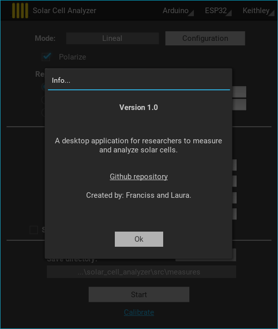
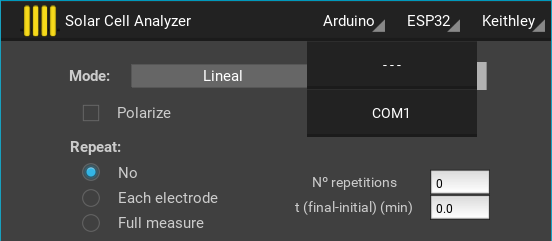

### Section 1: Mode setting ###
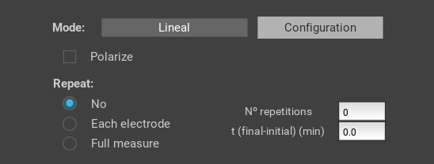
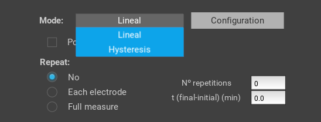

#### Mode configuration ####
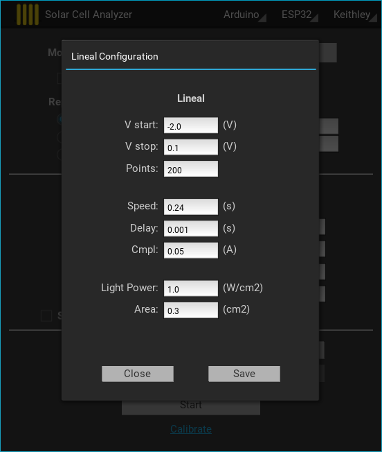
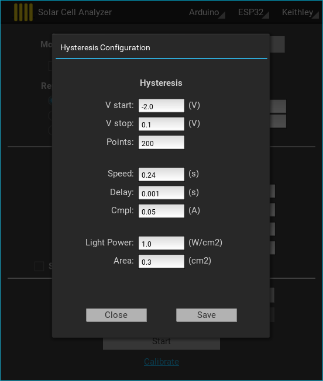

### Section 2: Electrode selection ###
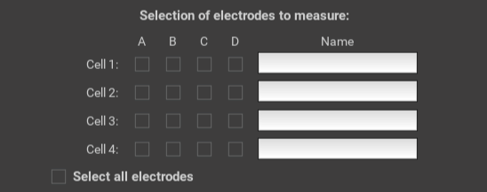

### Section 3:  Save settings, start measurement and calibration ###
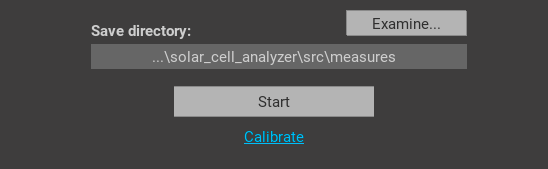

#### Save directory ####

#### Start measure ####
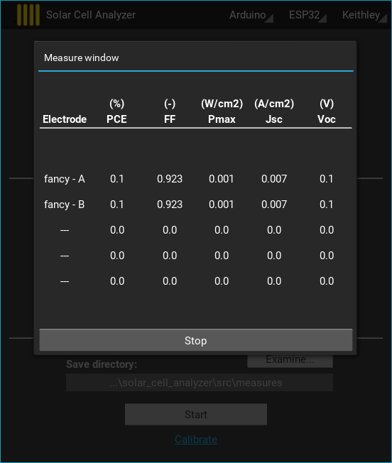
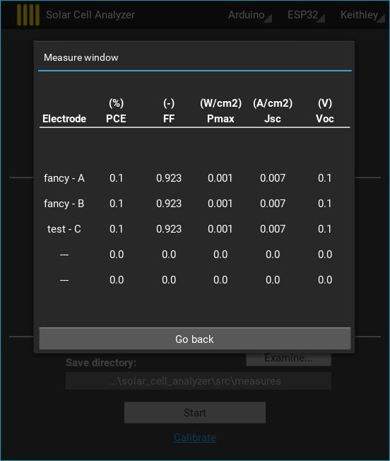

#### Polarize ####
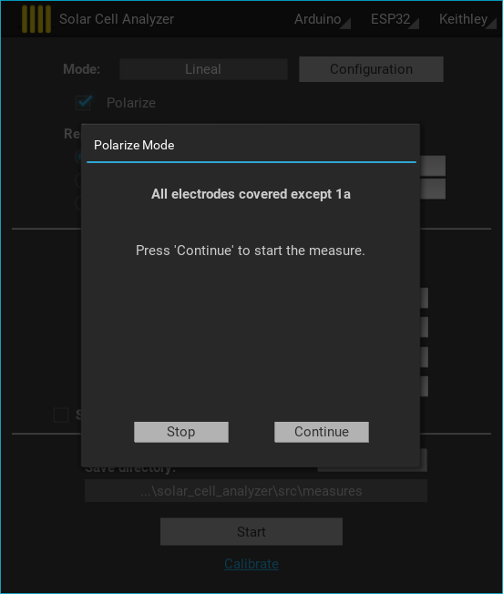
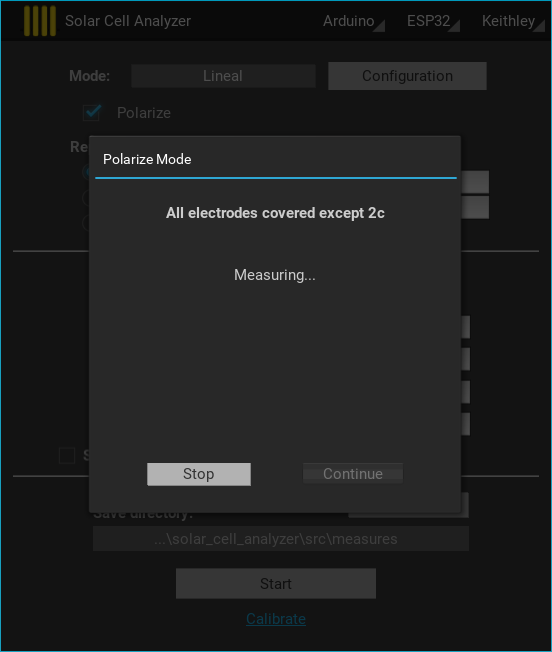
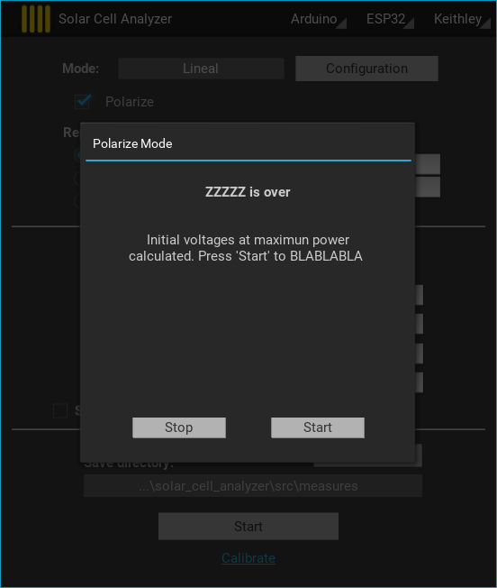

#### Calibrate ####
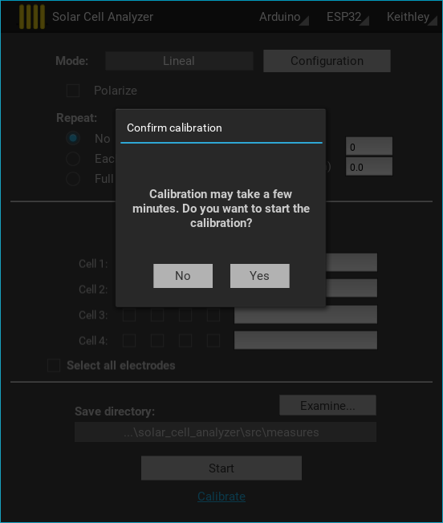
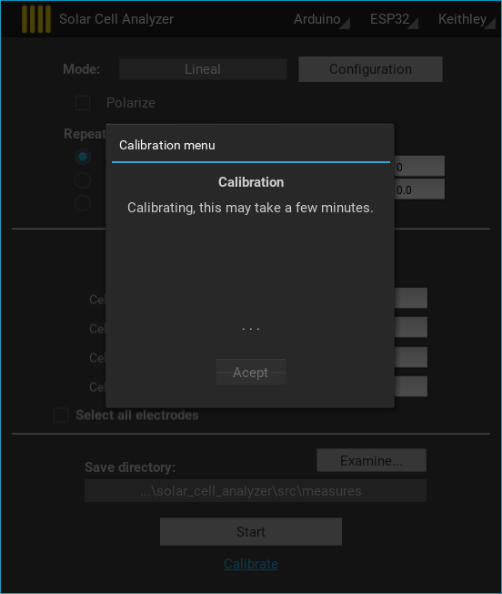

Este es un ejemplo de texto que da entrada a una lista genérica de elementos:

- Elemento 1
- Elemento 2
- Elemento 3

Este es un ejemplo de texto que da entrada a una lista numerada:

1. Elemento 1
2. Elemento 2
3. Elemento 3

Al texto en Markdown puedes añadirle formato como **negrita** o *cursiva* de una manera muy sencilla.